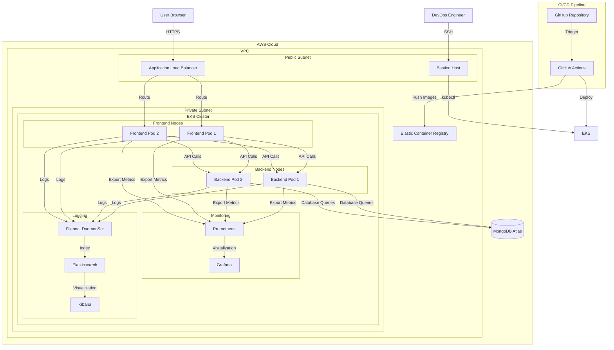
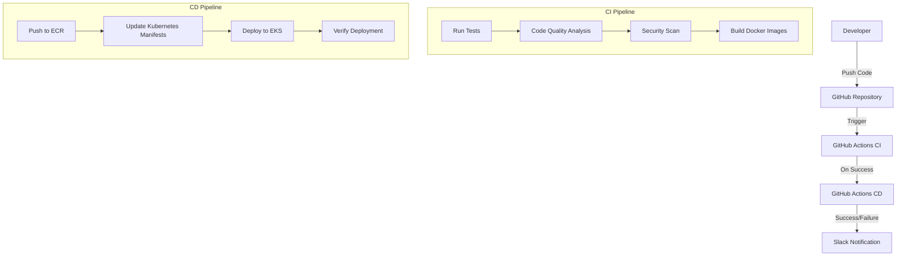
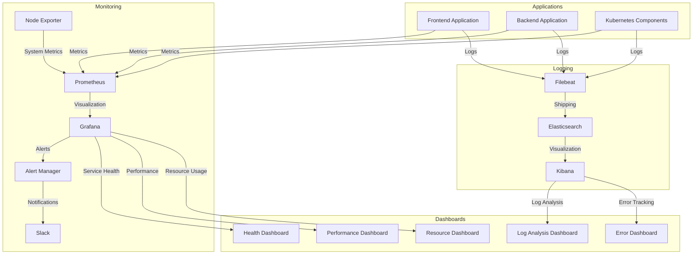

# Architecture Diagrams for Hostel Mess Management System

## System Architecture

## CI/CD Pipeline Flow

## Infrastructure as Code

```mermaid
flowchart TD
    subgraph "Terraform - Infrastructure Provisioning"
        VPC[VPC & Subnets] --> IGW[Internet Gateway]
        IGW --> NGW[NAT Gateway]
        NGW --> RT[Route Tables]
        RT --> SG[Security Groups]
        SG --> EKS[EKS Cluster]
        EKS --> NodeGroup[Worker Node Groups]
        NodeGroup --> IAM[IAM Roles & Policies]
        IAM --> ECR[ECR Repositories]
        ECR --> S3[S3 for State]
        S3 --> DynamoDB[DynamoDB for Locking]
    end
    
    subgraph "Ansible - Configuration Management"
        Configure[Configure Instances] --> Install[Install Tools]
        Install --> Deploy[Deploy Applications]
    end
    
    subgraph "Kubernetes - Application Management"
        Deployments[Deployments] --> Services[Services]
        Services --> Ingress[Ingress]
        Ingress --> ConfigMaps[ConfigMaps]
        ConfigMaps --> Secrets[Secrets]
        Secrets --> HPA[Horizontal Pod Autoscaler]
    end
    
    Terraform --> Ansible
    Ansible --> Kubernetes
```

## Monitoring and Logging Architecture

These diagrams can be rendered using Mermaid, which is supported by many Markdown renderers including GitHub.